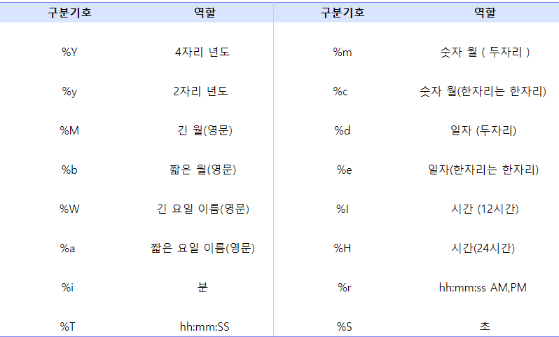

# MySQL 정리

1. 반올림, 내림

   ```mysql
   # 반올림 : ROUND(값,소수점 자리수)
   SELECT ROUND(14.13,1) FROM TABLE; # 출력 : 14.1
   
   # 버림
   SELECT TRUNCATE(14.13,1) FROM TABLE; # 출력 : 14.1
   ```

   

2. 변수선언

   ```mysql
   # SET @변수명 := 값 
   # @변수명
   
   SET @hour := -1; # 변수 선언
   
   SELECT (@hour := @hour + 1) as HOUR,
   (SELECT COUNT(*) FROM ANIMAL_OUTS WHERE HOUR(DATETIME) = @hour) as COUNT
   FROM ANIMAL_OUTS
   WHERE @hour < 23
   ```

   

3. if 조건문

   ```mysql
   # IFNULL(칼럼,결과)
   SELECT ANIMAL_TYPE, IFNULL(NAME, 'No name'), SEX_UPON_INTAKE
   FROM ANIMAL_INS
   ORDER BY ANIMAL_ID
   
   # IF(조건,결과1,아닐시결과2)
   SELECT ANIMAL_TYPE, IF(NAME IS NULL, 'No name'), SEX_UPON_INTAKE
   FROM ANIMAL_INS
   ORDER BY ANIMAL_ID
   ```

   

4. case when 조건문

   ```mysql
   # CASE WHEN 칼럼명 조건 THEN 결과 ELSE 아닐 조건 결과값
   
   SELECT ename ,
   	CASE
   		WHEN sal < 1000  THEN sal+(sal*0.8)
           WHEN sal BETWEEN 1000 AND 2000 THEN sal+(sal*0.5)
           WHEN sal BETWEEN 2001 AND 3000 THEN sal+(sal*0.3)
           ELSE sal+(sal*0.1)
       END sal
   FROM emp; 
   
   ```

   

5. 제곱, 나머지,절대값

   ```mysql
   # 제곱
   SELECT POW(2, 4); # 출력 값 : 16
   
   # 나머지
   SELECT MOD(4, 3); # 출력 값 : 1
   
   # 절대값
   SELECT ABS(-2); # 출력 값 : 2
   ```

   

6.  조인

   ```mysql
   #조인 방법
   SELECT 컬럼
   FROM A테이블명 JOIN종류 B테이블명
   ON A테이블컬럼 = B테이블컬럼
   
   #JOIN 종류
   INNER JOIN # JOIN(INNER 생략 가능)
   RIGHT OUTER JOIN # RIGHT JOIN(OUTER 생략 가능)
   LEFT OUTER JOIN # LEFT JOIN(OUTER 생략 가능)
   
   FULL OUTER JOIN # MySQL은 FULL OUTER JOIN이 없어서 right와 left 조인한 것을 union으로 대체
   
   #MYSQL에서 FULL OUTER JOIN 대체
   SELECT *
   FROM A LEFT JOIN B
   UNION
   SELECT *
   FROM A RIGHT JOIN B;
   
   
   #차집합(B-A)
   SELECT 컬럼
   FROM A테이블명 JOIN종류 B테이블명
   ON A테이블컬럼 = B테이블컬럼
   WHERE A칼럼 IS NULL
   
   ```

   

7. LIKE

   ```mysql
   # A로 시작하는 문자를 찾기
   SELECT 컬럼명 FROM 테이블 WHERE 컬럼명 LIKE 'A%'
   
   # A로 끝나는 문자 찾기
   SELECT 컬럼명 FROM 테이블 WHERE 컬럼명 LIKE '%A'
   
   # A를 포함하는 문자 찾기
   SELECT 컬럼명 FROM 테이블 WHERE 컬럼명 LIKE '%A%'
   
   # A로 시작하는 두글자 문자 찾기
   SELECT 컬럼명 FROM 테이블 WHERE 컬럼명 LIKE 'A_'
   
   # 첫번째 문자가 'A'가 아닌 모든 문자열 찾기
   SELECT 컬럼명 FROM 테이블 WHERE 컬럼명 LIKE'[^A]'
   
   # 첫번째 문자가 'A'또는'B'또는'C'인 문자열 찾기
   SELECT 컬럼명 FROM 테이블 WHERE 컬럼명 LIKE '[ABC]'
   SELECT 컬럼명 FROM 테이블 WHERE 컬럼명 LIKE '[A-C]'
   ```

   

8. DATE_FORMAT

   ```mysql
   #DATE_FORMAT(날짜,형식)
   
   SELECT NAME, DATE_FORMAT(DATETIME, '%Y-%m-%d') AS 날짜 FROM ANIMAL_INS
   ```

   
   


9. 날짜 계산하기

   ```mysql
   # 날짜 더하기
   DATE_ADD(기준 날짜, INTERVAL)
   
   # 날짜 빼기
   DATE_SUB(기준 날짜, INTERVAL)
   ```

   

10. 단어 합치기

   ```mysql
   SELECT member_id, CONCAT(round(coupon_price/order_price*100,2),'%') AS last_dc 
   FROM A;
   ```

   


# 문제

###  순위 문제 예시 테이블

```mysql
CREATE TABLE emp (
  `empno` int, 
  `ename` varchar(6), 
  `birth` datetime,
  `job` VARCHAR(30), 
  `sal` INT
  ) ; 
  
INSERT INTO emp 
(`empno`, `ename`, `birth`,`job`,`sal`) 
VALUES 
(7902, 'Ford', '2000-12-16 00:00:00','ANALYST',3000), 
(7788, 'Hoon', '2000-12-15 00:00:00','ANALYST',3000), 
(8864, 'Shen', '2000-12-14 00:00:00','CLERK',800), 
(8411, 'Blake', '2000-12-17 00:00:00','CLERK',950), 
(9417, 'Suzy', '2000-12-15 00:00:00','MANAGER',2450), 
(2414, 'Jones', '2000-12-18 00:00:00','MANAGER',2850), 
(4412, 'Martin', '2000-12-19 00:00:00','MANAGER',2950); 
```

1. 연속된 날짜 3일 이상인 데이터  확인하는 문제

   ```mysql
   set 
   @rownum:= 0, 
   @before_birth_plus1:="", 
   @before_birth_same:="";
   
   select empno,ename,rank
   from(
     select e.*,
     (
       case 
       when @before_birth_plus1 = DATE_FORMAT(e.birth, '%Y-%m-%d')
       then @rownum:=@rownum+1
       when @before_birth_sam = DATE_FORMAT(e.birth, '%Y-%m-%d')
       then @rownum:=@rownum
       else @rownum:=1
       end
     ) rank,
     (@before_birth_plus1:= (date_add(DATE_FORMAT(e.birth, '%Y-%m-%d'), interval 1 day))) before_birth_plus1,
     (@before_birth_sam:= DATE_FORMAT(e.birth, '%Y-%m-%d')) before_birth_sam
     from emp e
     order by e.birth
   ) rank_table
   where rank>=3;
   ```

   

2. 연봉 순위 매기기

```mysql
set @rownum:= 0, @cjob:="", 

SELECT empno, ename, job, sal, job_sal_rank 
FROM ( 
    SELECT a.*, 
    (
        CASE  
        WHEN @cjob=a.job 
        THEN @rownum := @rownum + 1 
        ELSE @rownum := 1 
        END
    ) job_sal_rank
    FROM emp a, 
    (SELECT @cjob :='',@rownum := 0 FROM DUAL) b 
    ORDER BY a.job,a.sal DESC 
) rank_table;
```

1. 

